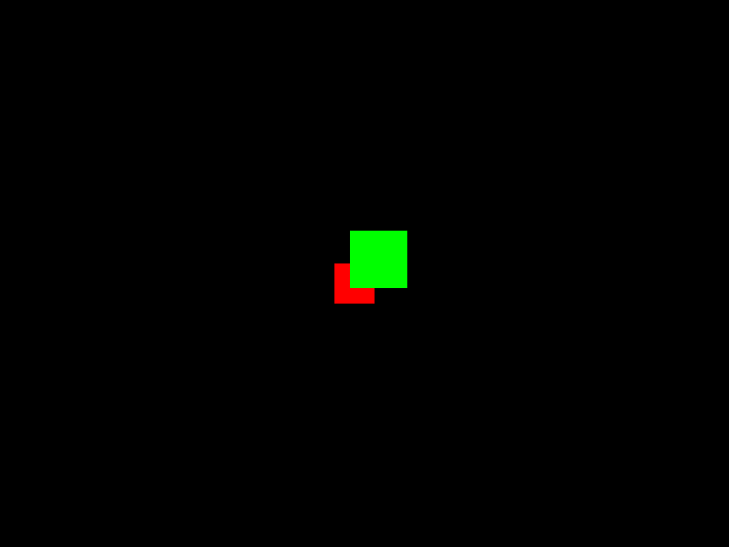

carna
=====

The objects in this module provide a simplified convenience interface for the more complex wrappers in the respective
sub-modules.

Example
-------

These can be used to, for example, quickly assemble a scene of multiple objects, and then render it into a NumPy array:

.. literalinclude:: ../test/test_integration.py
   :start-after: # .. example-start
   :end-before: # .. example-end
   :dedent: 8

Note on ``GEOMETRY_TYPE_OPAQUE``: A *geometry type* is an arbitrary integer constant, that establishes a relation
between the geometry nodes of a scene graph, and the corresponding rendering stages (see below for details).

This is the image ``array``rendered in the example:

Geometry Types
--------------

Each scene might contain multiple types of renderable objects. At least one could distinguish between polygonal and
volumetric objects. Planes are certainly a third type: They are neither polygonal because they are infinitely extended,
nor are they volumetric. It is up to the user to choose a more fine-grained taxonomy if required. Note that each
rendering stage expects to be told which *geometry type* it should render. For example, by using two CuttingPlanesStage
instances with different values for their *geometry type*, one could render multiple cutting planes with different
windowing settings.

API
---

.. automodule:: carna
   :imported-members:
   :members:
   :undoc-members:
   :show-inheritance: